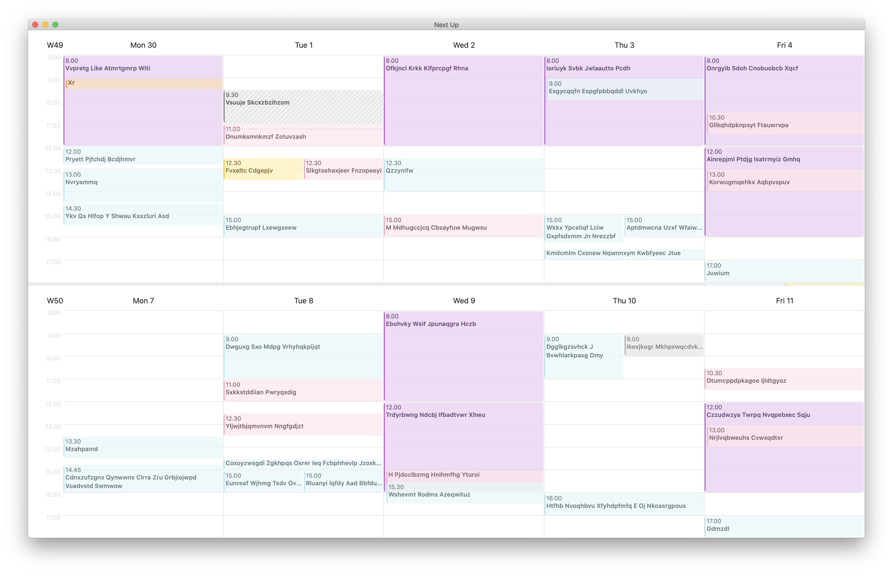

# Next Up - Work week for the next two weeks

## Overview

Mac app for planning what you should do next based on your calendar events for the next two weeks.

I created this because I need to know what I should be doing next. I want to see what is coming up next, today, tomorrow and this week, but also next week. Next week is particularly beneficial when arranging meetings. I didn't find a calendar app that can display two weeks with hour granularity like this app can.

A lot is missing for this app to be a generally useful and polished app.

*Note: data is masked in the screenshot above. This can be done by setting `MASK_EVENT_TITLES` to `true` in code.*

## Features

This app concentrates on the future. Past isn't important.

- View next two work weeks, so you know what you should do next, and when you will have time for something else.
- Week layout engine which produces results similar to Apple's quite nice Calendar app.
- No viewing event details. This app is for planning what you should be doing next.
- No editing. Editing is out of scope for this app.

## TODO

- Notifications when an event starts (or when event alerts happen)
- Add more unit tests
- Update when calendard change event comes
- Handle empty days ie. fill week with all days
- Current time indicator
- Update current time indicator (every minute in foreground?)
- If parent is same color/calendar, make child pop out (perhaps darken?)
- Min height for calendar events so text doesn't get clipped?

## Known Issues

- There are failing unit tests which capture event layouts which don't work (yet). I'm sure there are more cases where the layout engine (`displayEvents(from:)`) doesn't do as good job as it could. However, perfect or even great event layout isn't needed for this app to be useful.
- Needs customizability (could also read some values from System Preferences).
- Week is limited to 5 days.
- Weekend is assumed to be contigous block (which is true when week starts on Monday)
- Probably won't work with 12-hour clock, non-gregorian calendars and all-day events or events spanning multiple days

## Requirements

Requires macOS 10.15 or later.

## Technical Details

App is written in Swift and uses SwiftUI for the UI. Calendar events are read from EventKit (aka global macOS calendar store). Xcode 12 and Swift 5 are required.

I bet the app could be ported to an iPad very quickly. However, for my purposes, iPad app isn't very tempting. iPhones probably can't fit this much data on screen at once, and thus the traditional one-week display would be better.

A week calendar display component could be extracted from this app quite easily. Also the layout engine is suffiently separate from EventKit and from the display, so it could be extracted if needed.
